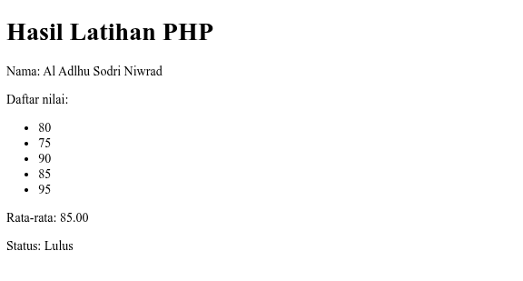
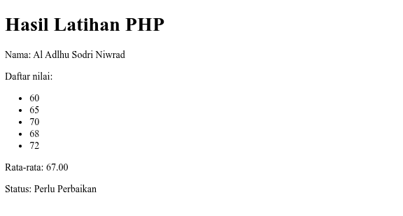

# Laporan Hasil Praktik
## Pertemuan 2: Latihan PHP Dasar

**Nama:** Al Adlhu Sodri Niwrad  
**Aplikasi:** Laravel 13  
**Route:** `/latihan-php`

## Tujuan

1. Mempraktikkan penggunaan variabel dan array dalam PHP.
2. Menghitung rata-rata lima nilai menggunakan fungsi dan `foreach`.
3. Menentukan status kelulusan menggunakan percabangan.
4. Menampilkan hasil secara dinamis pada halaman HTML polos.

## Kode dan Penjelasan

Source code utama terdapat pada [routes/web.php](../routes/web.php) dan view terdapat pada [resources/views/latihan-php.blade.php](../resources/views/latihan-php.blade.php).

### Variabel dan array

```php
$nama = 'Al Adlhu Sodri Niwrad';
$nilai = [80, 75, 90, 85, 95];
```

`$nama` menyimpan nama mahasiswa. `$nilai` menyimpan lima nilai integer. Route juga memiliki data uji kedua melalui URL `?uji=perbaikan`, yaitu `[60, 65, 70, 68, 72]`.

### Fungsi dan `foreach`

```php
$hitungRataRata = function (array $data): float {
    $total = 0;
    foreach ($data as $angka) {
        $total += $angka;
    }
    return $total / count($data);
};
```

Fungsi menerima array nilai dan mengembalikan tipe `float`. Variabel `$total` dimulai dari nol. `foreach` membaca setiap nilai sebagai `$angka`, kemudian operator `+=` menambahkan nilai tersebut ke total. Operator `/` membagi total dengan jumlah data dari `count($data)`.

### Percabangan status

```php
if ($rataRata >= 75) {
    $status = 'Lulus';
} else {
    $status = 'Perlu Perbaikan';
}
```

Operator perbandingan `>=` memeriksa apakah rata-rata minimal 75. Jika benar, statusnya `Lulus`; jika salah, statusnya `Perlu Perbaikan`.

### View Blade

View menggunakan HTML dasar dan Blade. `{{ }}` menampilkan data dengan escaping, sedangkan `@foreach` menampilkan seluruh nilai sebagai daftar HTML. `number_format($rataRata, 2)` memastikan rata-rata tampil dengan dua angka desimal.

## Hasil Dua Pengujian

### Pengujian 1: Lulus

URL: `http://127.0.0.1:8000/latihan-php`

Data: `80, 75, 90, 85, 95`  
Perhitungan: `(80 + 75 + 90 + 85 + 95) / 5 = 85.00`  
Status: **Lulus**



### Pengujian 2: Perlu Perbaikan

URL: `http://127.0.0.1:8000/latihan-php?uji=perbaikan`

Data: `60, 65, 70, 68, 72`  
Perhitungan: `(60 + 65 + 70 + 68 + 72) / 5 = 67.00`  
Status: **Perlu Perbaikan**



## Pembahasan

Program berhasil memisahkan data, proses, dan tampilan secara sederhana. Route menghitung rata-rata dan menentukan status, kemudian mengirimkan data ke view melalui `compact`. View hanya bertugas menampilkan hasil. Lima nilai pada pengujian pertama menghasilkan rata-rata di atas batas 75, sedangkan lima nilai pada pengujian kedua menghasilkan rata-rata di bawah batas tersebut.

## Kendala dan Solusi

Kendala awal adalah perintah `php artisan serve` tidak dikenali karena executable PHP belum tersedia pada `PATH` shell. Solusinya adalah menggunakan PHP Herd pada path berikut:

```sh
$HOME/.config/herd-lite/bin/php artisan serve
```

Mode query `uji=perbaikan` juga ditambahkan agar pengujian kedua dapat dibuka langsung melalui browser tanpa mengubah data utama.

## Kesimpulan

Praktikum berhasil menerapkan variabel, array, operator aritmatika, operator perbandingan, fungsi anonim, `foreach`, dan percabangan `if-else`. Halaman menampilkan nama, lima nilai, rata-rata dua desimal, dan status kelulusan pada HTML polos. Kedua skenario pengujian menghasilkan keluaran yang sesuai dengan logika program.

## Repository dan Source Code

Repository Git lokal berada pada folder project ini. Commit praktikum:

```text
6e00f23 Pertemuan 2 latihan PHP dasar
```

Source code:

- [routes/web.php](../routes/web.php)
- [resources/views/latihan-php.blade.php](../resources/views/latihan-php.blade.php)
- [Screenshot pengujian Lulus](screenshots/pengujian-lulus.png)
- [Screenshot pengujian Perlu Perbaikan](screenshots/pengujian-perlu-perbaikan.png)

Repository belum memiliki remote URL yang terdaftar, sehingga lampiran source code dan screenshot disertakan langsung di folder `laporan/`.
